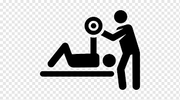

# Toros Gym Management System

In this project, I have developed a desktop-based gym management application for an imaginary fitness center.
The application is designed as a sample project for the SWE305 course and aims to simulate basic gym management operations.

The system manages gym members, trainers, and workout plans through a simple and user-friendly interface.

This project is intended to demonstrate object-oriented design principles and the use of the MVVM architectural pattern in a WPF desktop application.

## General Design Approach

While designing the application, I followed a simple but realistic approach.
Each class represents a real-life entity in a gym environment and only contains the attributes that are necessary for identifying and managing that entity.

A class should only store information that the application truly needs.
Unnecessary or overly detailed attributes are intentionally avoided to keep the design clean and understandable.

## Core Model Classes

The project includes the following main model classes:

### Member
Represents a gym member.
This class stores identifying and essential information related to members, such as their personal details and membership-related data.

### Trainer
Represents a trainer working at the gym.
It contains basic identifying information required to associate trainers with members or workout plans.

### WorkoutPlan
Represents workout plans assigned to members.
This class stores information about training programs without including unnecessary implementation details.

Each model class is designed to reflect its real-life counterpart while remaining minimal and focused.

## ViewModel Usage

ViewModel classes are used to manage the interaction between the user interface and the model classes.
They are responsible for dynamically displaying data and updating the UI when changes occur.

This separation ensures that the UI logic and the business logic remain independent, following the MVVM design pattern.

## Application Features

- Managing gym members
- Managing trainers
- Assigning and displaying workout plans
- Dynamic UI updates using data binding
- Clear separation of concerns using MVVM

## Technologies Used

- C#
- WPF (Windows Presentation Foundation)
- MVVM Architecture
- .NET
- LINQ
- GitHub for version control

## Demo Video

A demonstration video showing the functionality of the application is available at the following link:

https://drive.google.com/file/d/1hWTm6xECRcH1-9bNfulw9kA4z70WLzu5/view

## Notes

Screenshots are not included in this repository.
All core functionalities of the application are demonstrated in the video provided above.

## Icons Used in the Project

  
  &nbsp;&nbsp;&nbsp;
  

## Author

Anıl Keleş  
SWE305 – Toros University
